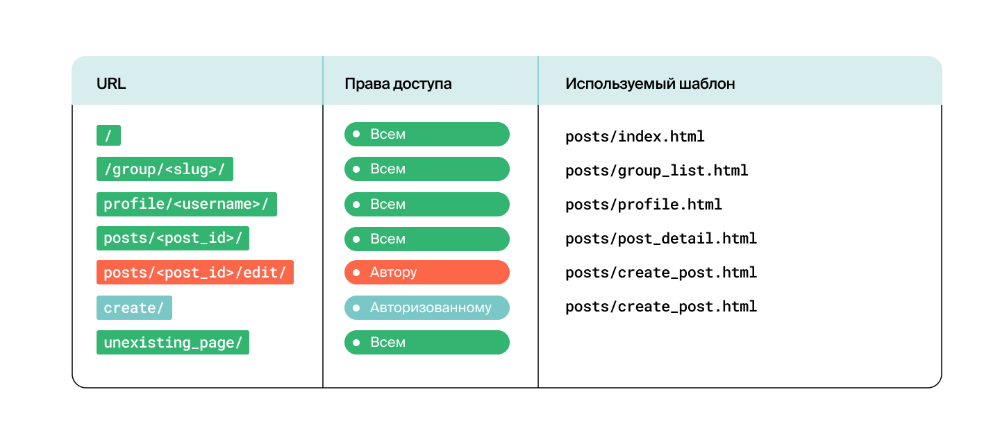
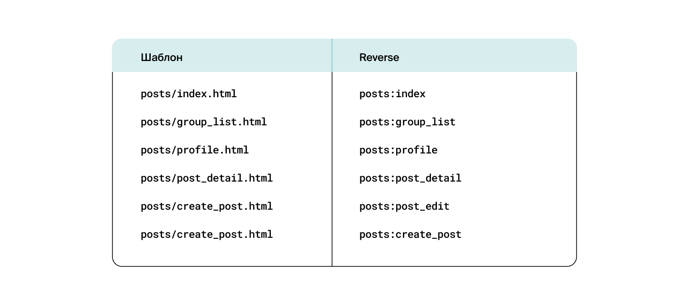
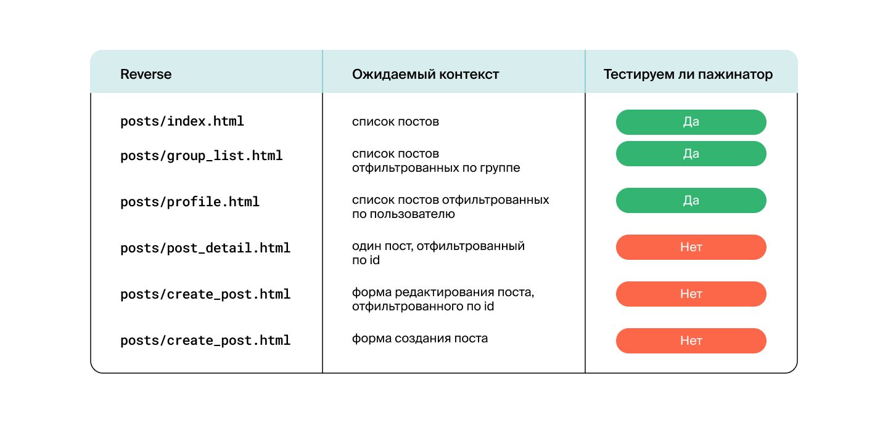

## Unittest в Django: 

### Тестирование Models

Протестировал модели приложения posts в Yatube.

Добавил в классы Post и Group метод __str__ (если его ещё нет):
- для класса Post — первые пятнадцать символов поста: post.text[:15];
- для класса Group — название группы.

Протестировал, правильно ли отображается значение поля __str__ в объектах моделей.

### Тестирование URLs

Проверка доступности страниц и названия шаблонов приложения Posts проекта Yatube.

Проверка должна учитывать права доступа.

Проверьте, что запрос к несуществующей странице вернёт ошибку 404.



### Проверка namespase:name и шаблонов

Тесты, проверяющие, что во view-функциях используются правильные html-шаблоны.



### Тестирование контекста

Проверка, соответствует ли ожиданиям словарь context, передаваемый в шаблон при вызове.



### Дополнительная проверка при создании поста

Проверил, что если при создании поста указать группу, то этот пост появляется:
- на главной странице сайта,
- на странице выбранной группы,
- в профайле пользователя.
- 
Проверил, что этот пост не попал в группу, для которой не был предназначен.

### Тестирование Forms

Написал тесты, которые проверяют, что:
- при отправке валидной формы со страницы создания поста ```reverse('posts:create_post')``` создаётся новая запись в базе данных;
- при отправке валидной формы со страницы редактирования поста ```reverse('posts:post_edit', args=('post_id',))``` происходит изменение поста с **post_id** в базе данных.

### Запуск тестов через терминал "bash"

1. Cклонировать репозиторий на свой ПК 

```git clone https://github.com/DamirShamsutdinov/Unittest.git```

3. Перейти в папку с проектом

```cd hw04_tests```

4. Создать папку "venv"

```python -m venv venv```

5. Активировать вирт.окружение

```source venv/Scripts/activate```

6. Установить все зависимости

```pip install -r requirements.txt ```

7. Перейти в папку *yatube*

```cd yatybe```

8. Ввести команду - запустятся тесты 

```python manage.py test```
